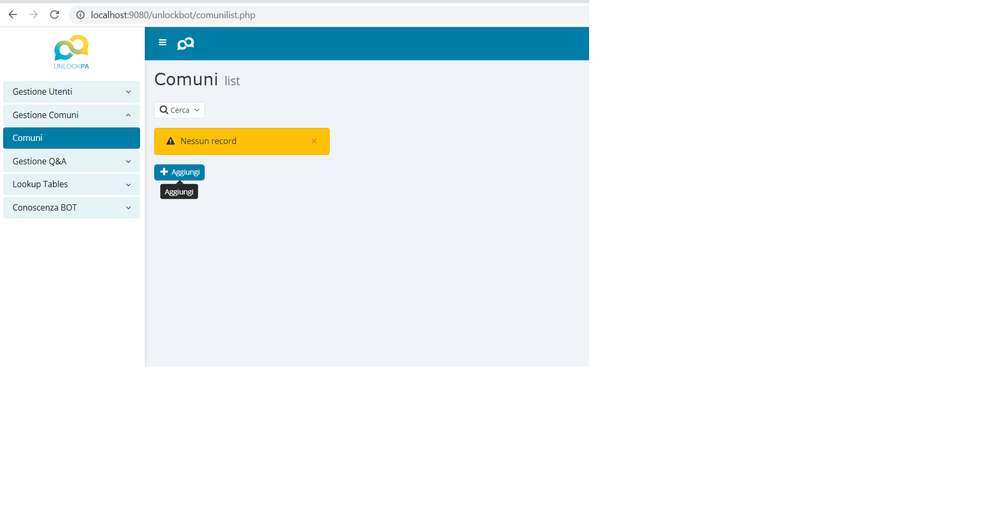
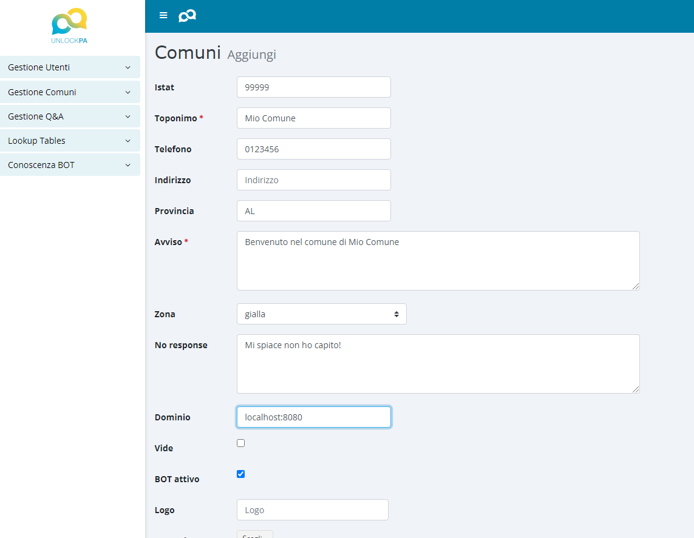
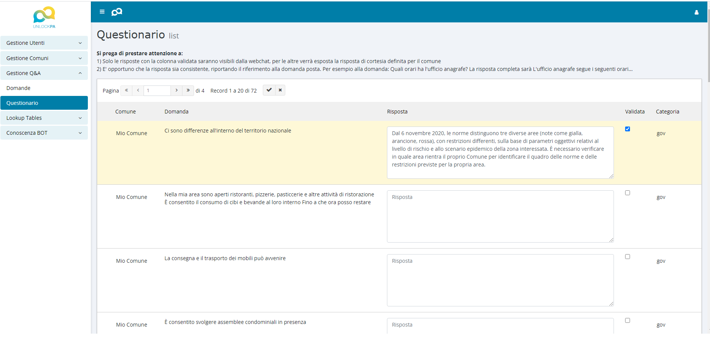

Per cambiare i parametri di ambiente andare in 

www/unlockbot/ewcfg15.php 

In quel file è possibile trovare i riferimenti al database, oltre al mailserver

E' possibile quindi lanciare il docker-compose, purchè prima sia stato avviato il database (vedi componente unlockdb)

La credenziali di default sono admin/admin.

Sotto gestione comuni è possibile creare un nuovo comune.

inserendo tutte le informazioni


Al termine dell'inserimento saranno automaticamente associate 
tutte le domande al comune stesso che potrà cambiare e validare le risposte 
nella sezione Gestione Q&A -> Questionario.




E' possibile anche creare un nuovo utente ed associarlo al comune con il ruolo di "Predefinito".
In tal caso quell'utente potrà operare solo sul comune selezionato.

Affinchè le domande ottengano risposta da parte del bot è necessario:
* che il comune abbia il flag bot attivo a True
* la domanda sia validata (flag a True)

Al termine della configurazione di un comune per esempio con dominio:
    * www.miocomune.it

Il servizio chatcontrolapi risponderà alla chiamata:
```
http://localhost:5100/comuni?domain=www.miocomune.it
```
con la risposta:
```
{
avviso: "Benvenuto nel comune di Mio Comune",
botattivo: true,
dominio: "localhost",
id: 4,
istat: "99999",
toponimo: "Mio Comune",
vide: null
}
```

e richiamando il servizio lockbotrasa su quel comune per una domanda valida otteniamo la risposta
```
curl -i -X POST \
   -H "Content-Type:application/json" \
   -d \
'{
"sender": "test_user",
"message": "Ci sono differenze in italia sul territorio?",
 "metadata": {"comune":4}
}' \
 'http://localhost:5005/webhooks/rest/webhook'
```

si ottiene:

```
{
	"recipient_id": "test_user",
	"text": "Dal 6 novembre 2020, le norme distinguono tre diverse aree (note come gialla, arancione, rossa), con restrizioni differenti, sulla base di parametri oggettivi relativi al livello di rischio e allo scenario epidemico della zona interessata. \u00c8 necessario verificare in quale area rientra il proprio Comune per identificare il quadro delle norme e delle restrizioni previste per la propria area.",
	"buttons": [{
			"title": "👍",
			"payload": "\/feedback_yes_no{\"feeback\":\"yes\"}"
		}, {
			"title": "👎",
			"payload": "\/feedback_yes_no{\"feeback\":\"no\"}"
		}
	]
}
]
```

